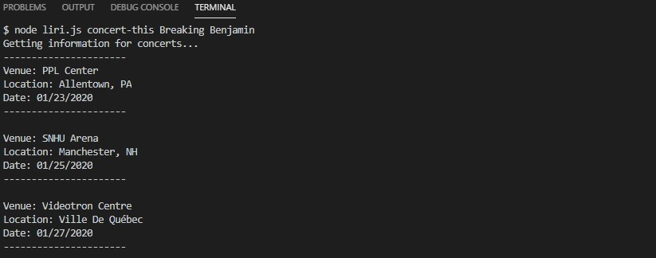
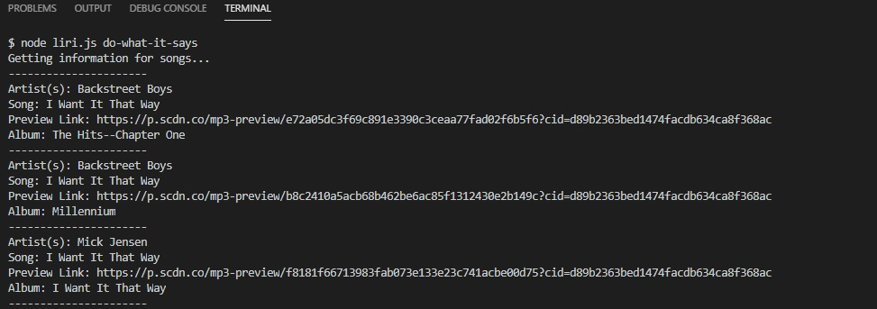

<h1>LIRI Bot</h1>

This application provides information about songs, movies, and concerts. Instead of using different applications for each task, we combined it to do all tasks in one app!

This application has four commands that the user can enter: concert-this, spotify-this-song, movie-this and do-what-it-says.

<b>Command Line Format:</b> node liri.js 'enter command' 'enter subject'

<h2>concert-this</h2>

This command will return information about bands performing concerts. It will give you the name of the venue, venue location and date of the event.

<b>Example:</b>

<h2>spotify-this-song</h2>

This command will return information about songs currently on Spotify. It will give you the artist(s), name of song, a preview link of song if available and the album that the song is from.

<b>Example:</b>

<h2>movie-this</h2>

This command will return information about movies. It will give you the title, year made, IMDB rating, Rotten Tomatoes rating, country produced, language of movie, plot and actors.

<b>Example:</b>

<h2>do-what-it-says</h2>

This command reads the random.txt file included in the project folder, and runs one of the above commands depending on the content of the file. The file contains a command and a subject with a comma separating them to be able to determine the command and the subject. 

<b>Example of random.txt:</b>

<b>Example of it being run:</b>

<h2>Technologies Used:</h2>

* Bands In Town API
* Spotify API
* OMDB API
* Node File System Module
